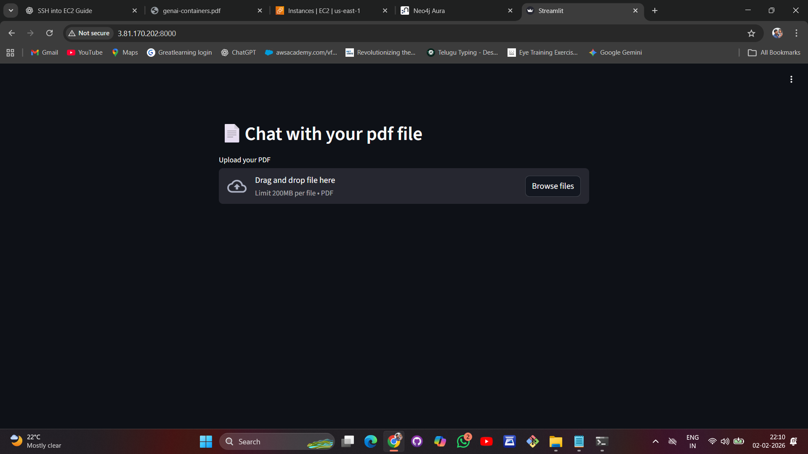
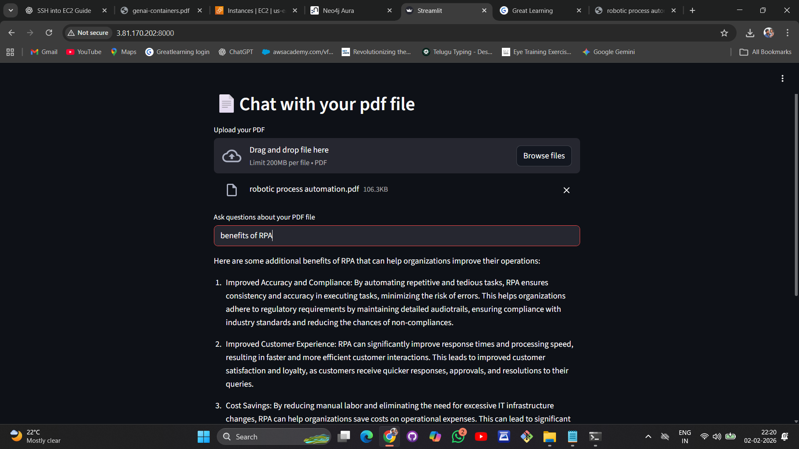

# docker-genai-sample

A simple GenAI app for [Docker's Docs](https://docs.docker.com/) based on the [GenAI Stack](https://github.com/docker/genai-stack) PDF Reader application.

## Model and Resource Considerations
Larger language models such as llama2 require higher system memory.  
For cost-efficient deployment on smaller EC2 instances, the orca-mini model was used to ensure stable performance.

## Cleanup and Cost Control
All cloud resources (EC2 instance and Neo4j Aura Free database) were terminated and deleted after successful validation to avoid unnecessary costs.

## Application Screenshots

### Chat with PDF Interface

### Answer Generation

